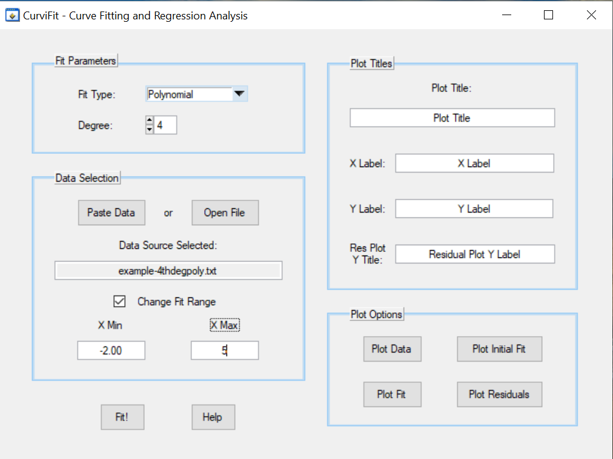
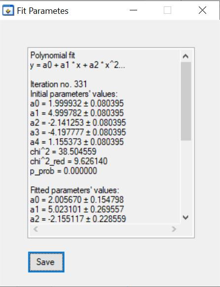
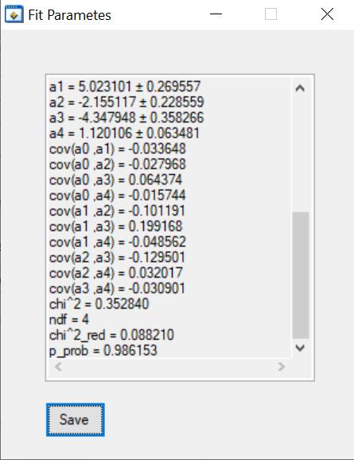
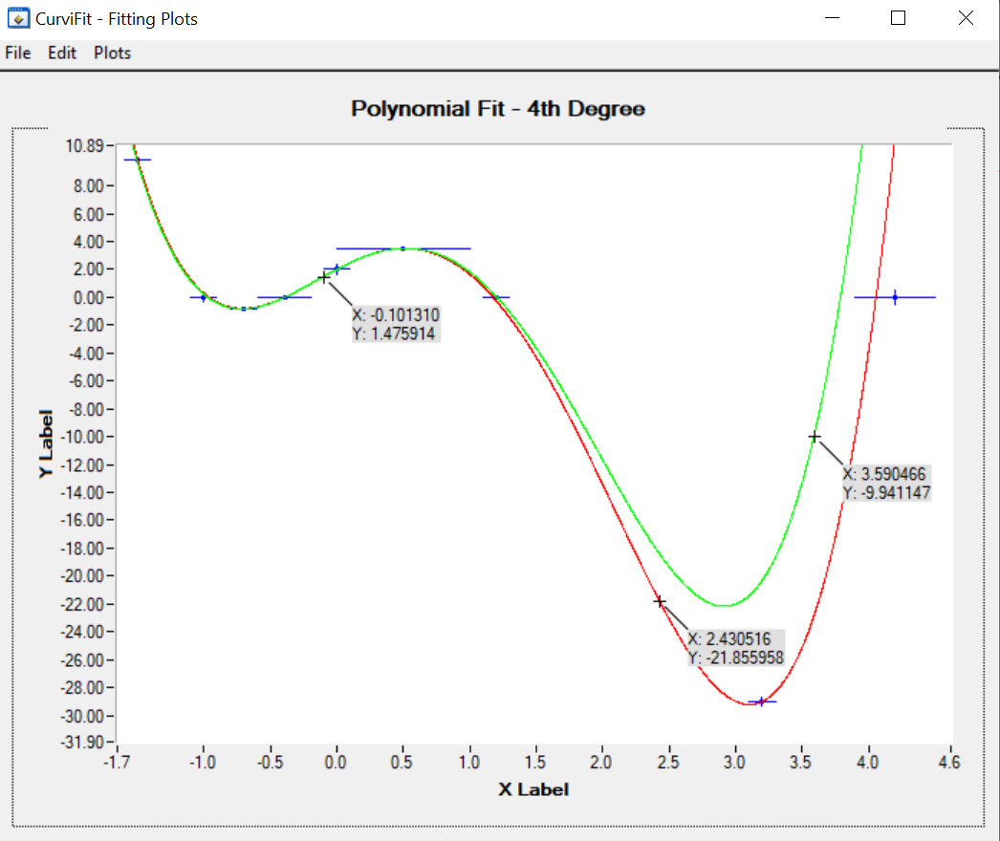
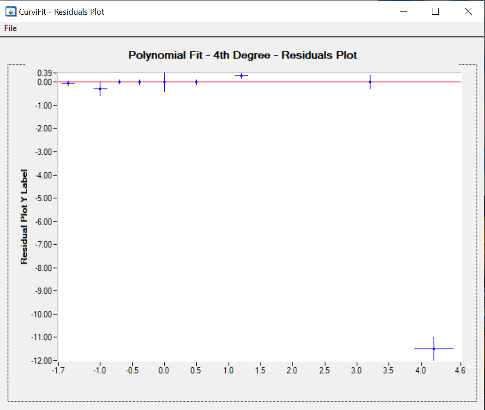
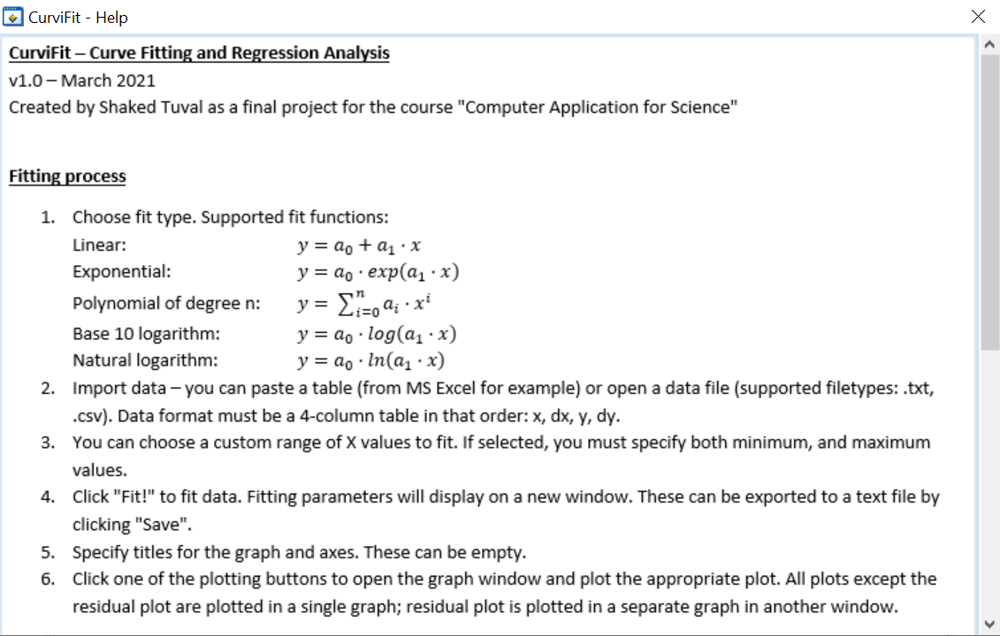

# Curve Fitting Tool (C, LabWindows/CVI)

A scientific tool developed as a final project in C, designed to fit experimental measurement data to various models.

## Supported Models
- Linear
- Polynomial (user-defined degree, up to 10)
- Exponential (base e and 10)
- Logarithmic (any base)
- Gaussian

## Features
- Import data from file or clipboard
- Define and control fitting range
- Auto-estimation of initial parameters
- Levenberg–Marquardt optimization
- Error propagation on both axes
- Graphical plots: data, fitted curve, and residuals
- Export results to file

## Detailed Features

- Import data from a file or directly from the clipboard  
- Display measurement graph with error bars  
- Define fitting range within the imported data  
- Perform initial fit using built-in CVI functions  
- Display initial fit graph  
- Fit supported functions: linear, polynomial (up to degree 10), exponential, Gaussian, logarithmic (base e and 10)  
- Custom curve fitting algorithm (written from scratch)  
- Calculate fitting parameter errors and covariance matrix  
- Evaluate fit quality (Chi-squared, reduced Chi-squared, p-value)  
- Plot resulting fit curve  
- Plot residuals graph  
- Allow user-defined graph and axis titles  
- Export fitted parameters to a text file  
- Integrated help window explaining how to use the tool

**Graph window features:**

- Manually set axis ranges  
- Add/remove up to 5 labels to graph points  
- Toggle visible curves  
- Export graph as image file

## Screenshots

### Main Interface  
Full control panel for function selection, input data, axis titles, and fitting options.  

### Fit Results  
Initial and final parameter values, with uncertainties and covariance matrix shown.  

### Fit Results – Graph  
Fitted curve (green), initial guess (red), and data points with error bars. Includes interactive point labeling.  

### Residuals Plot  
Residual values plotted against X, highlighting fit quality and outliers.  

### Help Window  
Built-in help window explaining the fitting process, function definitions, and usage steps.  

## Folder Structure

- `src/`: Source code and UI file  
- `examples/`: Sample input files for different models  
- `screenshots/`: Output images (to be added)

## Usage

To compile and run, use LabWindows/CVI.  
Load `datafit.uir` for the graphical interface. Example input files are provided in `/examples`.

---

**Note:** Project documentation is in Hebrew (see PDF file)